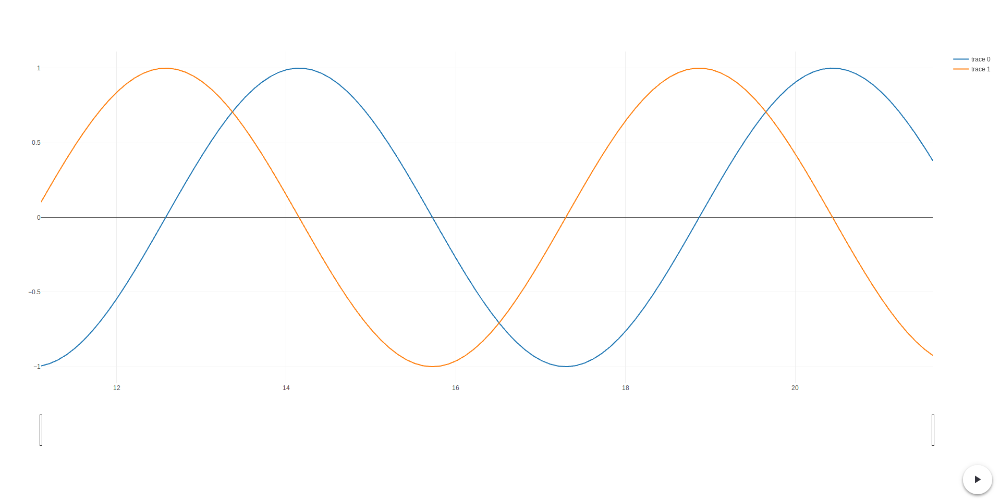

# Plotit

This project is maintained on [gitlab](https://gitlab.com/lelongg/plotit).

## Overview

Plotit allows live visualization of multiple time series read from terminal.

Plotit consumes standard input formatted as CSV and will build a trace for each field.
Plotit open a new tab in your browser in which a [plotly](https://plot.ly/) graph is continuously updated.

This is **experimental** software.
It was made as an experiment to build a standalone wasm client and web server communicating through websocket, both fully written in Rust.

The port *9001* is used internally for the websocket and the port *8000* is used for the [rocket](https://rocket.rs/) server.
These ports cannot be changed at this time.

## Prerequisites

This project depends on Rust **nightly**.
You can install the `nightly` toolchain and override your Rust toolchain for this project by running the following commands while inside this repository.

```bash
rustup toolchain install nightly
rustup override set nightly
```

Building client requires `cargo web` and `wasm` target.
You can install it with the following commands.

```bash
rustup target add wasm32-unknown-unknown
cargo install cargo-web
```

## Quickstart

You can download prebuilt binaries at [this address](https://gitlab.com/lelongg/plotit/-/jobs/artifacts/master/download?job=build).
Decompress the archive and run the following command.

```bash
./noise | ./plotit
```

A new tab should display live plotting of sine waves. Go take a look at your browser !



The `noise` binary is an example program which continuously output sine waves samples to standard output.

```
0.7173560908995227, 0.6967067093471655
0.7833269096274833, 0.6216099682706645
0.8414709848078964, 0.5403023058681398
0.8912073600614353, 0.4535961214255775
0.9320390859672263, 0.3623577544766736
0.963558185417193, 0.26749882862458735
```

## Build

This repository comes with a Makefile allowing to build and run Plotit easily.  
Type `make build` to compile Plotit.

## Usage

```bash
my_program | plotit
```

Go to your browser at [localhost:8000](http://localhost:8000).
